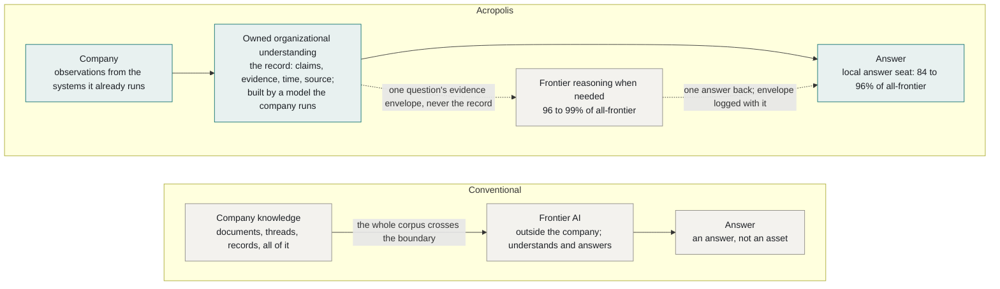
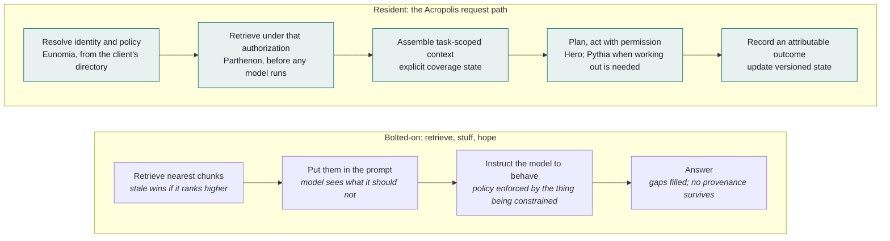

# Acropolis: a governed model of the organization, measured

> This is the machine-readable version of *Acropolis: a governed model of the organization, measured*, v1.0. The canonical published version is the PDF in `releases/` (DOI: to be assigned). The Markdown may continue to evolve; the release is frozen.

Figures: `figures/acropolis-figures.html`. Numbers come from
the run reports under `../reproduction/reports/`; how they were produced is Appendix A
(`methodology.md`). Section 6's
cost table is from the 2026-08-20 BEAM ingest run and is marked as such.

## Abstract

A company does not need to hand its institutional knowledge to a frontier model for an
AI to understand it.

We find that institutional understanding and frontier reasoning can be separated: a
locally operated 31B model can build the organizational record, and a frontier model
can be rented only for per-question reasoning over that record. Across three public
benchmarks, replacing the model that builds the organizational
record with a locally operated 31B open-weight model changes downstream frontier
performance by one to two points. Keeping the entire system local retains 84 to 96
percent of all-frontier performance. Renting a frontier model only for answering, where
it sees the evidence for one question at a time and never the record, raises that to 96
to 99 percent.

The system that makes the separation possible is Acropolis, a governed operational
model of an organization: a substrate that decides what an AI system may know and do
before it does either. It holds claims rather than chunks. Every claim carries its
evidence, its time of validity and its source; nothing is silently overwritten; graphs,
vectors and summaries are disposable projections of a canonical record the company
owns and can export. Because the record is the asset, the models around it are seats,
and seats can be filled by whoever the company chooses.

We measured the substrate with one committed harness on LongMemEval-S, LoCoMo and BEAM
100K, twice: once with a frontier model in every seat, and once with every seat on a
local Gemma-4-31B model. We report the retrieval, answering and governance columns for both, the
negative results along the way, what is measured by construction rather than by adversarial test, and what still needs a live organization to settle.

## 1. Access is not understanding

An agent with credentials to the wiki, the CRM, the tracker and three years of Slack
still does not know who owns a decision, which of four documents is current, what was
tried last quarter and abandoned, or what it is allowed to repeat to whom.

That is the gap every enterprise AI deployment falls into, and the two standard fixes
do not close it on their own.

The first fix is more context. Put the documents in the prompt, or retrieve the closest
chunks and put those in the prompt, and ask the model to behave. This is what most of
the market calls retrieval-augmented generation. Four things go wrong with it in
practice, and none of them is intrinsic to retrieval. A model composing from fragments
fills the gaps between them, and nothing in the pipeline knows a gap exists. A chunk
from March and a chunk from June about the same fact are two chunks, and whichever
ranks higher wins. The answer is a string, and unless something outside the model kept
the citations, the evidence was a context window that no longer exists. And when
access control is applied by instructing the model, the policy is enforced by the thing
you are trying to constrain. Each of these can be bolted on around a retrieval pipeline:
citation logging, temporal filters, contradiction checks, retrieval-time ACLs. Teams do
it, one property at a time, and every one of them is a feature of that team's pipeline
rather than a property of the record. Acropolis makes them properties of the substrate, so that every reader of the record
inherits them by construction.

The second fix is a bigger model. It helps with the first failure and does nothing for
the other three. It also carries a cost the first fix hides: to understand the company,
the bigger model has to be shown the company. Every document, every thread, every
customer record goes out to whoever runs the model, and what comes back is an answer,
not an asset.

We took a different position. The problem is not that the model knows too little. It is
that nothing in the stack holds a governed, current, attributable model of the
organization in which the model can participate. Build that, and the model becomes a
replaceable seat. The organizational understanding is the asset.

That position has a testable consequence, and it is the one this paper adds. If the
understanding lives in a record the company owns, the model that builds the record and
the model that reasons over it are different seats, and they can be filled differently.
A model the company runs on its own hardware can do the understanding. A frontier model
can be rented for the thinking, one question at a time, seeing only the evidence for
that question. Section 2 is the experiment. The rest of the paper is what makes the
result possible and what it does not yet prove.

**Figure 1. The brain stays inside; a question-sized envelope can leave.** Source: `figures/figure-1-boundary.mmd`.

## 2. The experiment: separating knowing from thinking

Three public benchmarks, one committed harness, no questions or conversations authored
by us. LongMemEval-S is 500 questions over multi-session chat histories, 30 of them
unanswerable traps. LoCoMo is 435 questions over very long two-person conversations, 88
unanswerable. BEAM 100K is 400 questions over twenty conversations of about 100,000 tokens each,
across ten question types, with 40 unanswerable. BEAM is run at 100K tokens per conversation
for the local campaign; the 1M variant is reported only for the frontier reference
configuration in Section 5, and the two are not compared to each other in this paper. Retrieval is scored on
document identity before any answering model runs; answers are judged by a fixed
protocol that scores a confident wrong answer as wrong. Appendix A has the definitions,
the prompts and the commands.

The system has three model seats. The understanding seat builds the record: it reads
the conversations and proposes the claims the record holds. The retrieval seat rewrites
the question and ranks the candidate evidence. The answer seat composes from the
evidence envelope it is given, alone or in a bounded reasoning loop. Every row below fills the understanding seat with Gemma-4-31B, an open-weight model on one
rented GPU, with local embeddings. "Local" throughout means ownership and operation,
not the location of the machine: an open-weight checkpoint served under our own control,
with no inference sent to a model-provider API. The rows differ in who fills the other
two.

> **[Figure 2 — Own the knowledge, rent the thinking: how much frontier you get without a frontier brain]**
> One table, three benchmarks, five rows on the same local brains; the reference row on the published brains closes it. The distance table beneath it. "Local" is Gemma-4-31B on one H200 with local embeddings; "frontier" is the same frontier models as the published reference.

| configuration | understands | thinks | LongMemEval-S | LoCoMo | BEAM 100K | BEAM 100K, own protocol |
|---|---|---|---|---|---|---|
| Own everything, best local configuration | local | local | 87.4 | 76.3 | 47.2 | 57.3 |
| Own the knowledge, rent the thinking | local | frontier answer seat | 90.0 | 79.3 | 53.8 | 66.4 |
| Rent only when the local answer refuses | local | local, frontier on refusals | 88.6 | 80.5 | 48.5 | — |
| Frontier in every seat, same local brains | local brains | frontier | 89.6 | 81.8 | 55.2 | 66.8 |
| Reference: published brains, frontier in every seat | frontier | frontier | 91.4 | 81.8 | 56.2 | 67.5 |

Read as a share of the all-frontier reference, the configuration the site scores
today:

| | all frontier | fully local | rent the thinking | rent on refusals | questions sent out |
|---|---|---|---|---|---|
| LongMemEval-S | 91.4 | 87.4, 95.6% | 90.0, 98.5% | 88.6, 96.9% | 27 of 500 |
| LoCoMo | 81.8 | 76.3, 93.3% | 79.3, 96.9% | 80.5, 98.4% | 40 of 435 |
| BEAM 100K, strict | 56.2 | 47.2, 84.0% | 53.8, 95.7% | 48.5, 86.3% | 8 of 400 |
| BEAM 100K, own protocol | 67.5 | 57.3, 84.9% | 66.4, 98.4% | | |

● Every row in both tables has full per-question reports in the published bundle
(Appendix A.12).

"Own everything" is the better of the local single-call and local-loop configurations,
with no frontier model anywhere: the single call on LongMemEval (87.4; the loop reads 86.0), the
loop on LoCoMo and BEAM (the single call reads 73.6 and 42.0). Renting the thinking keeps the record, the retrieval and the ranking
local and rents one seat, the answer; the frontier model sees one question's evidence
envelope, a few thousand tokens of claims and excerpts, and the envelope is stored with
the answer. Renting on refusals keeps the local loop's answer wherever it answered, and sends out
only the questions it declined. With the local single-call answers as the base instead,
LongMemEval reads 88.4 or 88.8 depending on which frontier row answers the refusals. BEAM is scored two ways because strict
correctness gives no credit for a partially ordered list or a partial summary; BEAM's
own protocol does, and the appendix prints both.

Three things are in those tables, and they are the argument of this paper.

**The understanding seat holds.** Brains a local model built, with about 60 percent as
many accepted claims as the frontier extractor produced on the same conversations,
score within one to two points of the published brains once a frontier model runs the
other seats: 89.6 against 91.4, 81.8 against 81.8, 55.2 against 56.2. Retrieval on them
is the same or better: Hit@5 99.2 against 99.0, 91.2 against 90.7, 39.2 against 40.6.
The material gap does not appear in what the local model writes down; it arises
downstream, in the seats that read it.

**The cost of owning everything is in the reading seats, and it grows with the length
of what has to be read.** The best local configuration trails frontier-everywhere on the
same brains by 2.2 points on LongMemEval, 5.5 on LoCoMo and 8.0 on BEAM. On every benchmark the loss
has the same shape: the local model ranks candidates less well over long excerpts
(Hit@5 80 against 91 on LoCoMo, 34 against 39 on BEAM, on identical pools), and it
composes less well from them. A cross-encoder reranker was tried as the cheap fix and
refuted: on the same LoCoMo pool it ranked 28 points below the local language model,
because ranking a long excerpt against a question is a reading job. A contract rewrite
aimed at the local answer seat's observed mistakes was tried on both LoCoMo
conversations and lost half a point. The loop is not a free lever either: it pays 2.7
points on LoCoMo and 5.2 on BEAM, and costs 1.4 on LongMemEval.
The gap is model capacity at length, and the paper says so rather than dressing it.

**Renting the thinking buys most of it back.** Swapping only the answer seat for a
frontier call lifts the local stack to 90.0, 79.3 and 53.8, which is 98.5, 96.9 and 95.7
percent of the all-frontier reference. On BEAM's own protocol that row, 66.4, is 98.4
percent of it and within noise of frontier everywhere, 66.8. On LongMemEval it is above
the site's published core number. Renting only on refusals sends 2 to 9 percent of
questions out and reads 97 and 98 percent on the two benchmarks where the local model
refuses often enough for it to matter; the two mechanisms together, local retrieval
with a rented answer and escalation on its refusals, read 91.4 on LongMemEval, the
reference itself, with 21 questions escalated.

> **[Figure 3 — BEAM 100K by ability: what renting the answer seat buys back]**
> Grouped columns per ability under BEAM's own protocol: local loop, rented thinking, frontier on the same brains.

The guard columns survive the swap. With no frontier model in any seat, 29 of the 30
LongMemEval traps are refused. On LoCoMo the local rows refuse 70 to 75 of 88 traps
against 70 to 80 for the frontier rows. Provenance is the same in every row because it
is a property of the record, not of the model reading it.

Two caveats on the BEAM table. Event ordering and summarization read 0 to 3 of 40 for
every configuration under strict correctness and 15 to 37 under the protocol, local or
frontier; they are the benchmark's hardest types for everyone. And contradiction
resolution, the question type closest to this paper's thesis, is under half for every
row: the answers name the disagreement and quote both sides, as the contract instructs,
but the two evidence messages reach the envelope together on too few questions. That is
the reranker again.

The model is a replaceable seat. The organizational understanding is the asset. The
rest of the paper is about the record that makes that true.

## 3. What Acropolis is

One sentence carries the topology: Varys sees, Parthenon holds, Eunomia orders, Hero
acts and communicates, Pythia answers, Ariadne reaches, MUXI runs it all. Acropolis is
the machine.

The names are deliberate. People-names act; place-names hold. Nothing that holds may
act, and nothing that acts may hold. That rule is the architecture.

**Parthenon holds.** It is the brain: a client-owned, versioned, exportable store of
observations, evidence, claims and the projections built from them. It never acts. It
receives proposals through one signed intake door, validates them, and accepts, rejects,
deduplicates or supersedes. A claim in Parthenon says: source S stated X at time T, here
is the evidence span, here is the interval over which X was true, here is what
superseded it and when. Nothing is deleted; things are corrected, disputed or
superseded, and the change log records which.

**Varys sees.** Connectors, backfill, triage, extraction, proposal. Varys reads the
approved systems, distils observations into candidate claims and submits them to
Parthenon's door. It never speaks to a person and never changes operational state.
Everything it proposes can be refused. The model that does the distilling is the
understanding seat of Section 2.

**Eunomia orders.** The identity service. It fronts the client's own directory and
answers one question for both Hero and Parthenon: who is this, what groups, whose data.
It stores no memberships of its own. The directory stays the single source of identity
truth.

**Hero acts and communicates.** The agent harness, built on MUXI, the open-source
agent-formation substrate. Hero lives in Slack or Teams, runs formations, carries the
channels. One Hero binds to one brain by structure, not by filter: a work Hero reads the
company Parthenon, a personal Hero reads a private one.

**Pythia answers.** Some questions need working out rather than looking up: how long
between two events, how many devices in total, whether the absence of a fact is an
answer. Pythia is a bounded loop with three tools, ask Parthenon, compute
deterministically, extract, and a mandatory time anchor. No world tools, ever. Her
answers carry a second kind of warrant: derived from claims X and Y by operation O,
beside Parthenon's asserted by source S at time T. The model inside the loop is the
answer seat, the one seat Section 2 shows is worth renting.

**Ariadne reaches.** A desktop agent, paired per user with consent on the user's
machine, dispatched by Hero when the work is local. She grants no authority and holds no
memory.

Put those together and the ordinary agent request changes shape. Instead of retrieve,
stuff, hope, it becomes: resolve identity and policy, retrieve under that authorization,
assemble task-scoped context with an explicit coverage state, plan, act with permission,
record an attributable outcome, update versioned state. Observation is read-only. Memory
is persistent. Execution is permissioned. Identity travels with the request. Action
happens at the edge.

**Figure 4. Bolted-on retrieval and the resident request path, step by step.** Each failure mode sits where it enters the first path; each Acropolis step names the component that decides it. Source: `figures/figure-4-request-path.mmd`.

This is the architecture for resident AI: the AI lives inside the company that owns it,
runs where the work already happens, sees the whole operation, runs on infrastructure
the company owns, and what it learns belongs to the company in a form it can export.
The full thesis is at varops.com/resident-ai. A resident is not a tool invoked per
query. It accumulates context, carries identity, and needs what a new employee needs on
day one: to know what is current, who owns what, and what it is allowed to do. The
fourth condition is why Parthenon is client-owned and exportable rather than a service
the company rents.

The threat model is explicit. Acropolis is built to prevent an over-privileged agent
reading what its principal may not; leakage across brains or tenants; and stale or
contradictory context leading to a confidently wrong action. It does not address a
compromised endpoint, an insider who legitimately holds high privilege, or a
compromised model provider. When an external model is rented for a seat, the evidence
envelope for that question leaves the customer's perimeter: a few thousand tokens of
claims and excerpts, never the corpus and never the record. The envelope is logged with the answer, so what leaves is itself auditable. Section 2
quantifies how often that happens under refusal escalation, 2 to 9 percent of
questions, and what it buys. Only a fully local deployment sends
nothing out, and Section 2 reports what that costs.

## 4. Seven properties, and what each one measures

The properties below are not delegated to prompt compliance. Retrieval, authorization,
coverage accounting and provenance are code paths and record structure; the model
composes inside the boundary they set. Some benchmark performance does depend on how the
model is instructed, and the paper measures that too. Here is each property, with its
measurement where one exists and the plain words "by construction" where a test has not
attacked it.

**What the model sees is decided before it runs.** Retrieval, authorization and coverage
accounting are deterministic code paths that run before any model is called. The model
composes an answer from an evidence envelope; it never decides what it was allowed to
see. Whether it asserts beyond that envelope is a contract instruction, and its
compliance is what the guard columns measure: across four full LongMemEval runs, 25 to
28 of the 30 unanswerable-trap questions were correctly refused each run, and one answer
in the 120 trap rows was classified as a fabrication under manual review. With no
frontier model in any seat, 29 of 30. That is one fabrication in the tested trap sample
under the stated protocol; it is not a general hallucination rate, and the paper does
not treat it as one.

**Absence is labeled, never silent.** Every question resolves to an explicit coverage
state: answered, searched-and-empty, or outside-the-ontology. "The system found
nothing" and "the system holds no concept of this" are different answers and callers
can tell them apart. This is why an abstention column exists at all: BEAM abstention
75.7 under the governed composite, against 52.5 for Vendor X, the commercial memory layer of Section 5. We also
measured what the column costs, by removing it. The same LongMemEval configuration
instructed never to say the information is missing scored 87.2 against 88.0 with the
refusal intact, and turned 30 refusals into 30 fabrications. Scored on answerable
questions only, the way never-refuse systems report, the same answers read 92.8. The
refusal buys nothing on the headline and everything on the guard column.

**Every answer carries its evidence.** Answers cite the claims they rest on; each claim
carries its source, timestamp and evidence span; derived conclusions carry the trace of
what they were computed from. An auditor can walk any answer back to the conversation
line it came from. Measured exhaustively on the stored runs: all 118,890 claims
delivered across 2,500 LongMemEval answers resolve to a stored observation with a
source identity, and an audit of 2,233 answers against the evidence each received finds
unsupported wrong assertions in about one answer in a hundred, at the same rate for
local and frontier models.

**Access control at the substrate, not in the prompt.** Callers hold cryptographic
identities; every request carries signed authorization; scopes resolve at the substrate
itself, per caller. A caller below a scope cannot distinguish "withheld" from "empty",
so permissions cannot be probed through absence. Isolation is one Postgres schema per brain, failing closed. It has been attacked: an
adversarial probe against live per-brain
servers, five brain pairs and nine cases each, refused or contained all 45. Wrong-tenant,
foreign-key, tampered, expired and missing assertions are refused with no data; an
assertion replayed against another brain's server returns none of the first brain's
claims; naming another brain or another principal's scope is refused.

**One writer, one validation path.** Nothing a model says grants itself storage. All
writes flow through the signed intake door, which validates, deduplicates, supersedes
and can reject. On the BEAM ingest a first conversion emitted human-readable dates
instead of RFC 3339; the door quarantined 5,732 submissions and accepted zero claims
rather than store them. After the fix: 388 submitted, 388 accepted. A store would have
indexed the garbage.

**Reproducible by construction.** An answer records the snapshot, plan and authorization
decision it was produced under. Every benchmark report records the dataset hash, the
code revisions with a dirty-tree flag, and the model pins. The reports behind every
number in this paper are published with it, under the release gate in Appendix A.12.

> **[Figure 5 — Refusal posture is a dial with two measured endpoints]**
> Two-point line on BEAM-abstention × LongMemEval-accuracy, Acropolis only; the comparison stays in Figures 7, 8 and Table 2.

**Governance is a dial, not a destiny.** Refusal posture is a deployment configuration
with two measured endpoints. The synthesis-forward setting scores LongMemEval 90.5 and
BEAM abstention 50.0; the balanced setting scores 89.4 and 64.3. One contract cannot
maximize both, and we measured that rather than asserting it: three contract variants
scored 56.4, 57.4 and 57.1 overall on BEAM. Knobs redistribute points between refusal
and coverage. They do not create them. We confirmed it once more in September: a fourth
contract written against the local model's observed mistakes moved LoCoMo from 73.0 to
72.2 on 435 paired questions, gaining on some and losing on others, with the refusal
count unchanged. Systems that weld in a never-refuse posture cannot publish this
column, and do not.

> **[Table 1 — Evidence map: every property with its status]**
> Table with status chips and the evidence cell for each. Legend: measured (a run exercised it and a score depends on it) · by construction (built in, every run had it, never attacked) · specified (designed, partly built, no benchmark exercises it) · not measured (implied by the design, no test exists) · planned (not built).

## 5. The frontier configuration, and the comparison

Section 2 reported the local campaign against the all-frontier reference. This section
is the reference itself, the configuration the site has published since August: a
frontier extractor, a frontier reranker, a frontier answer. Everything is identity-scored
at the published budgets.

> **[Figure 6 — Retrieval holds to a million tokens, then meets the cliff]**
> Hit@5 → Hit@10 dumbbells per dataset, frontier and local brains; MRR in the caption.

### Retrieval

| | LongMemEval-S | LoCoMo | BEAM 1M |
|---|---|---|---|
| questions | 500 | 432 | 700 |
| corpus per question | multi-session history | 10 long conversations | ~1M tokens |
| Hit@10 | 99.80% | 93.06% | 44.00% |
| Hit@5 | 99.00% | 90.74% | 35.84% |
| Recall@10 (strict) | 95.80% | 82.64% | 16.16% |
| Recall@10 (micro) | 97.36% | 77.29% | 8.86% |
| MRR | 0.9846 | 0.8225 | 0.2546 |

◐ August retrieval reports partially retained; the local-brain retrieval rows in Figure 6
are ●.

Read the BEAM column first if scale is the question. Every system we have measured, or for which comparable figures are published,
falls off a cliff at a million tokens per question, ours included, and the memory-layer
comparison's own figures show the same cliff: 94.4 on LongMemEval, 64.1 on BEAM 1M, 48.6
on BEAM 10M. We publish the retrieval figures at that scale. Most competitors do not.
Retrieval is identical across every answering configuration below; the agentic layer
consumes the same ranked evidence the direct path does.

> **[Figure 7 — LongMemEval answering: three configurations and one never-refuse comparison]**
> Bars with run bands; the local-brain rows and the never-refuse probe beside Vendor X.

### Answering, LongMemEval-S

| configuration | accuracy | notes |
|---|---|---|
| Acropolis core | 89.2% | band 88.4 to 89.6 over repeated full runs |
| Acropolis agentic (Pythia) | 90.5% | band 90.4 to 90.6, four full runs |
| Acropolis agentic + frontier escalation | 91.6% | escalation only on the system's own refusals |
| Vendor X¹ | 98.0% | never-refuse protocol |

◐ The three Acropolis rows are re-runnable from the tagged harness; their August
per-question reports are partially retained (Appendix A.12). The local-brain rows of
Figure 7 and the reference rows on the published brains are ●.

Vendor X is a commercial memory layer: retrieval and answering over conversation
history, with none of the identity, authorization, or execution components described
in Section 3. Its figure is under a never-refuse protocol and is not directly
comparable to Acropolis's accuracy: by design, that protocol cannot lose points for
refusing. We measured the size of that bias on our own system rather than estimating
it. Under a never-refuse contract, the same brains, retrieval and judge score 87.2 on all
500 questions and 92.8 on the 470 answerable ones (the 30 traps count as wrong when not
refused). Because 30 of the 500 questions are
unanswerable traps that count as correct only when refused, a system that never
refuses caps at 94.0 under the official rule. A published 98.0 therefore must score
those traps differently or exclude them, and it is judged by a protocol that does not
treat a confident wrong answer on an unanswerable question as wrong. In practice, the
98.0 cannot be compared to Acropolis's 89.2 to 91.6 as if they were measured under
the same rules.

Governance columns: 25 to 28 of 30 unanswerable traps correctly refused per run; one
fabrication in the tested trap sample under the stated protocol.

### Answering, LoCoMo

Accuracy 81.8% on the 432-question sample the site publishes, Hit@5 90.7.

> **[Figure 8 — BEAM 1M per category: where the governed composite leads and where it trails]**
> Grouped columns, composite vs Vendor X, on abstention, contradiction, summarization, multi-session.

### Answering, BEAM 1M (full 700 questions)

| configuration | overall | abstention | contradiction | summarization | multi-session |
|---|---|---|---|---|---|
| Acropolis core² | 60.2 | 74.3 | 64.7 | 31.9 | 58.6 |
| Acropolis governed composite³ | +3.5 over its paired core | 75.7 | 62.1 | 56.4 | 57.9 |
| Vendor X¹ | 64.1 | 52.5 | 35.7 | 63.5 | 65.2 |

◐ Re-runnable from the tagged harness; August per-question reports partially retained
(Appendix A.12).

The governed composite is a deterministic routing policy over two complete runs: a
cheap direct pass's refusals and contradiction declarations ship as they are, 150 of
700 rows, and a frontier synthesis loop answers the rest. No oracle, no picking the
better score per question. Its headline is abstention 75.7, the highest of any
configuration we have measured and 23 points above the comparison, with contradiction
handling 26 points above, while nearly doubling the core system's summarization. It
lands within about three points of the comparison's overall figure under a
cross-protocol comparison, with every refusal intact.

Full core per-category: preference 83.2, extraction 82.1, instruction 77.8, abstention
74.3, contradiction 64.7, temporal 63.5, knowledge-update 63.4, multi-session 58.6,
summarization 31.9, event-ordering 26.0.

> **[Table 2 — Head to head, with the protocol differences on the table]**
> Full comparison table: Acropolis core / agentic / composite vs Vendor X, best per row bold, dashes for unpublished, footnotes attached.

¹ Vendor X figures as published by the vendor under its own protocol, which instructs
the model never to state that information is missing, so a refusal can never cost it a
point; it does not publish retrieval or abstention metrics at the 1M-token scale. It is
a memory layer only: no identity, authorization, or execution components. Acropolis
figures include honest refusals and are measured under our documented aggregation; both
sides' guard columns are shown so the trade is visible.

² Core band from the August gate campaign under its published aggregation.

³ Governed composite measured on the full 700 questions as a deterministic routing
policy over two complete runs, validated live on the governance categories. Its overall
is stated as a paired delta because it was measured under a rebuilt aggregation
formula; absolute cross-formula comparisons are not valid, per-column and paired figures
are.

## 6. The cost of record

A lossless index and a governed, intentionally lossy, multi-tenant substrate on rented
CPU are not the same kind of thing, and the comparison above should be read knowing
what the second one costs to run. These figures are from the BEAM 1M ingest of
2026-08-20: 35 conversations, roughly 35 million tokens.

> **[Figure 9 — The cost of record: stat tiles]**
> $8.24 ingest · $0.0021 per claim · $0 index · $0.0037 per question · 0 quarantined.

| stage | measured |
|---|---|
| hardware | 2 × Intel Xeon Platinum 8280, 16 cores, 31 GB, no GPU |
| ingest, one time | 17,745 accepted claims for $8.24 over 37,387 LLM calls |
| | $0.0021 per claim, about $0.24 per million-token conversation |
| | 0 quarantined: the door accepted nothing malformed |
| projection, one time | 72,986 documents embedded for $0, CPU only, local nomic |
| retrieval | $0.00365 per question |

Two facts most stores cannot claim. The embedder is free and local: there is no
embedding vendor in this stack and no GPU in these machines. And the whole corpus cost
under ten dollars to ingest and nothing to index.

Distillation is deliberately lossy. We throw information away on the way in and still
put the right evidence in the top ten on 99.8% of LongMemEval questions. Compression
that keeps the answer is a system property, not a retrieval trick.

The local campaign adds the other half of the bill. Building the LoCoMo brains took 53
and 70 minutes per conversation on one H200 with 16 extractions in flight. Answering is
where a 31B model is slow: on BEAM 100K the fully local rows ran at a median of 12 to
15 minutes per question with 14 conversations sharing the GPU, against under a minute
for the frontier rows, because the synthesis prompts run near 57,000 tokens. That is a
throughput figure for a shared benchmark box, not a single-user latency, and it is the
honest price of the "own everything" row.

### What this means for a deployment

The benchmarked layer is the knowledge substrate: ingestion, distillation, retrieval and
answering over conversational history. The governance properties are architectural:
authorization before context, explicit absence states, provenance on every answer. The
tables show they coexist with strong retrieval and answering on public datasets, and
that the understanding half of the system can run on hardware the company owns without
moving the numbers: 84 to 96 percent of the all-frontier score with nothing rented, 96
to 99 percent with the answer seat rented. That is the sovereignty claim in concrete
form: the company can own the brain and keep most of the performance. What is measured
on fixtures rather than
live organizations are the enterprise-hardening properties: identity resolution at
scale, permission propagation through a real directory, and operational outcomes. Those
are the next validation steps, not assumed capabilities; a buyer should treat them as
such when pricing risk and rollout.

## 7. Limitations

### 7.1 Measured on fixtures, not live organizations

All identity, permission and task-scoped results in this paper are measured on
controlled fixtures: a generated organization, a synthetic directory, scripted changes.
They demonstrate mechanism and correctness under test conditions, not behavior under a
real company's directory, reorganizations and operational load. Section 7.2 details the
fixtures; Section 8 lists the live-organization tests that would move these from
mechanism demonstrated on fixtures to validated in production.

### 7.2 Identity, permission and task-scoped fixtures

Identity resolution and permission-change propagation were measured on a bounded
fixture rather than a live directory: a generated organization of 1,000 people across three namespaces, with 50
evidence-backed duplicate merges and 20 conflicting handles. The fixture resolved 3,030
references with none wrong or missing, surfaced each conflict as typed ambiguity naming
both candidates, and restored a reversed merge; a directory change
reached the next issued assertion immediately with the cache off and within the cache
TTL with it on. An assertion already issued carries the directory generation it was
issued against, and a deployment that polls the generation feed refuses it within the
poll interval once the directory changes: measured at 976 milliseconds with a
one-second poll, three seconds by default, against a five-minute assertion. When the
feed is unreachable the last known generation is honoured through a grace window and
the deployment then fails closed, which was measured too. Aliases at scale,
reorganizations and a live directory remain unexercised.

Task-scoped context, the two-stage path where an agent asks for constraints before
planning and for entity context after candidates exist, is built and drilled rather
than benchmarked: a batch of questions is answered under one assertion, one scope and
one snapshot; context is returned for several entities in one envelope; and every
envelope carries a validity token that a revalidate call reports stale after the first
change in its scopes, while a token for another brain or an ungranted scope is refused.
No public benchmark exercises the two-stage ask, so its row is measured by mechanism,
not by score.

Graduated disclosure is built and measured: rungs are derived when a fact is accepted,
superseded or retracted, never redacted at read time, and an end-to-end drill shows a
finance reader receiving the precise value while a sales reader receives the band and
the trend on the same subject with no byte of the precise value in the envelope. What
is not claimed is coverage of the rule kinds beyond band, trend and the floors the
tests exercise.

### 7.3 What is not claimed

The local placement was measured on one open-weight model, Gemma-4-31B, on one rented
H200. No claim is made about other open-weight models or smaller hardware; the
sub-$100,000 figure is a hardware class, not a measured bill. The BEAM local rows are
on the 100K variant, not the 1M variant the site publishes for the frontier
configuration, and the two are not compared to each other anywhere in this paper. The
1M variant on a local model is a cost question, not an open one, and it was not run.

The judge is a language model operating under a fixed prompt. A local 31B model
re-judging 2,223 stored LongMemEval answers under the same prompt agreed with it on
98.7 to 99.2 percent of verdicts and preserved every ordering; on LoCoMo, where gold
answers are longer free-text spans, agreement was 95.2 percent and the local judge was
stricter on every row. The scores do not hinge on which model judges. The one human
step in scoring is the manual classification of the non-refused trap rows, which
changes no score and is published for re-classification. Comparisons to other systems
are cross-protocol and labeled so wherever they appear. None of the three datasets is
enterprise-shaped.

Two negative results are reported rather than buried. A local cross-encoder reranker
did not close the local retrieval gap; it widened it. And prompt contracts written
against observed failure modes did not move scores: three variants on BEAM in August
landed within a point of each other, and one written for the local model in September
lost half a point on 435 paired questions.

## 8. Posture, and what comes next

Refusal posture ships as a labeled configuration. A deployment picks the balanced
setting or the synthesis-forward one knowing what each costs on each benchmark, and the
paper reports both endpoints rather than the more flattering one.

Model placement ships the same way. A deployment picks own everything, own the
knowledge and rent the thinking, or rent only on refusal, and Figure 2 is the price
list. The recommended default is the middle row: the company builds and holds the record on
hardware it owns, and rents a frontier model only for per-question answering, which
sees only that question's evidence envelope. On the benchmarks this configuration
scores 96 to 99 percent of the all-frontier reference, exceeds the published core
number on the easiest dataset, and keeps the organizational record on hardware the
company owns. A deployment that wants nothing rented at all
starts at 84 to 96 percent and can escalate its own refusals, 2 to 9 percent of
questions, to close most of the rest.

The model is a replaceable seat, and we have the receipt three times over: swapping the
extraction model from a frontier vendor to a 31B open-weight model moved the
frontier-seat scores by one to two points on every benchmark, measured on identical
questions. The organizational understanding is the asset. It is the part that does not
change when the model does: provenance, state, identity, policy, boundaries.

What is next is the reading seat: a local model that ranks and composes over long
excerpts as well as a frontier model does. That is the one gap the local campaign left,
and the levers that pay there are a stronger open-weight reranker and better local retrieval,
not another contract clause. The tests in Appendix A.14 that still need a live
organization, identity at real scale, permission changes through a real directory,
operational outcomes, are the other campaign, and the paper will not claim them until
one has run.

The harness, the aggregator, the per-question reports and the manifest that ties them
to the figures above are published with this paper. Re-run what we ran. Where a figure
cannot be independently re-run, the paper says so next to the figure.

---

Cite as: VarOps, "Acropolis: a governed model of the organization, measured", Draft 7,
2026-09-15. Methodology: Appendix A, reference v1.2.
